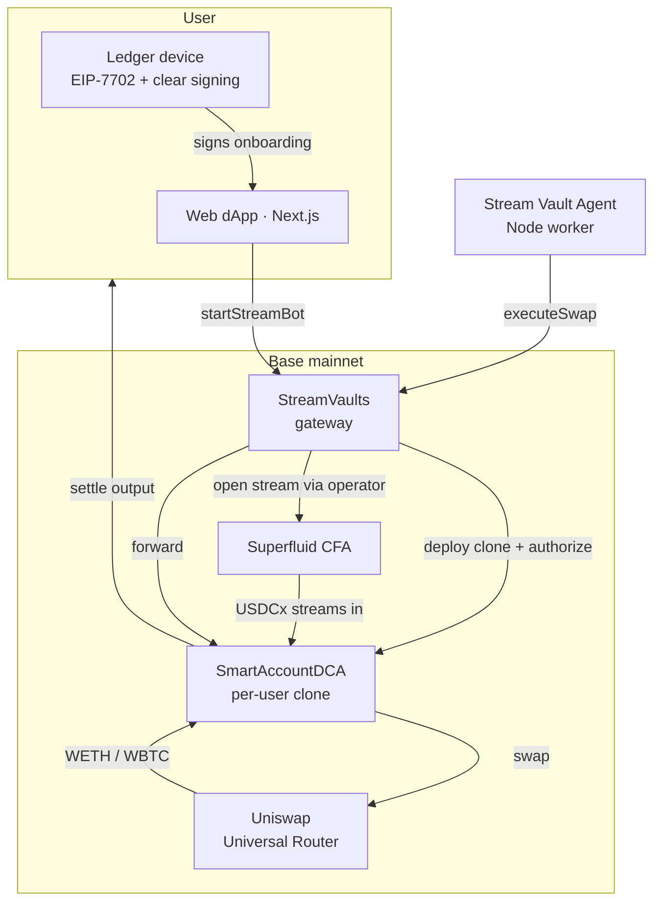
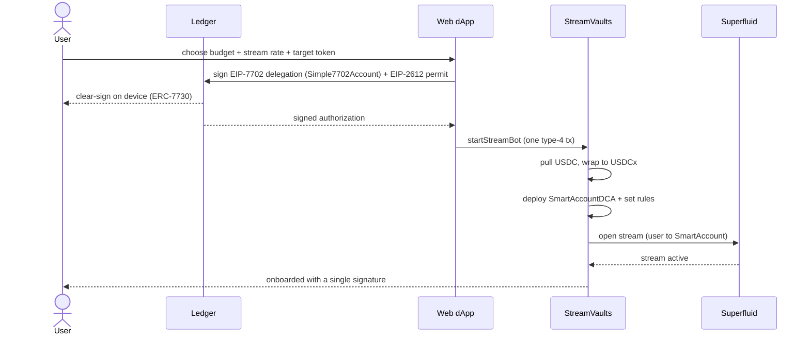
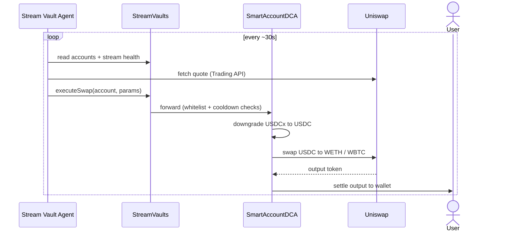
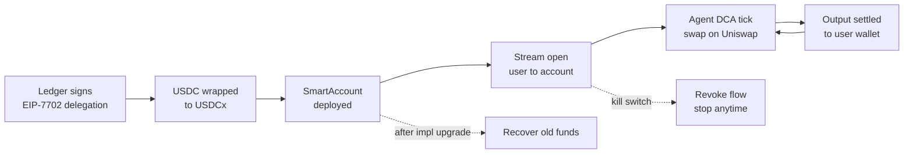

# StreamVaults

> Capital streaming as a security layer for DeFi. **Pay your DCA agent while you use it.** The protocol only ever holds the capital that has already streamed in.

Instead of locking a lump sum in a vault, the user opens a [Superfluid](https://www.superfluid.finance/) stream toward a **per-user autonomous smart account** that dollar-cost-averages into WETH/WBTC on Uniswap and settles the output straight back to the user's wallet. Exposure is bounded to **hours of flow, not full TVL**. If an exploit ever hit a stream-based vault, the loss would be measured in hours of streamed capital.

Live on **Base mainnet** (chainId `8453`).

## How it works

**Everything starts from the user's Ledger.** Onboarding is signed in hardware: a single EIP-7702 device signature (with ERC-7730 clear signing) wraps USDC, deploys the user's smart account, and opens the stream in one atomic transaction. The live flow is tested end-to-end from a real Ledger device.

### Architecture



### User onboarding (starts at the Ledger)



### DCA execution (the agent)



### End-to-end lifecycle



The user keeps a **kill switch**: revoking the Superfluid flow-operator permission stops everything. Exposure is bounded to the streamed balance, never the full deposit.

## Two executors, one contract

The DCA logic does not have to run as our Node worker. The agent is written in a hexagonal style, with the strategy, cooldown, and stream guard kept pure behind ports, so the exact same core can run two ways:

- **Stream Vault Agent (Node worker).** A single hot key calls `StreamVaults.executeSwap`. It is fast to run, easy to debug, and what we deploy today as the baseline executor.
- **Chainlink CRE workflow.** The same DCA tick runs on a decentralized oracle network. Instead of one key, the DON reaches consensus on the reads, the quote, and the write, then lands a DON-attested report on Base through the `KeystoneForwarder` into `StreamVaults.onReport`.

The seam between them is the contract. Both paths land in the same internal logic, so every on-chain guard (target and token whitelists, slippage floor, swap cooldown, stream auto-close) applies either way. `onReport` is gated to `config.bot()` and reuses those guards, so it is not a backdoor. Switching from one executor to the other is a single owner transaction that repoints `config.bot()` to the EOA or to the forwarder, and it is reversible.

The CRE path removes the single-key trust assumption: there is no private key to leak, and execution becomes verifiable and censorship resistant. We verified the workflow landing a real `executeSwap` on Base mainnet through `onReport`.

## Live on Base mainnet

| Contract | Address |
|---|---|
| StreamVaults | `0x773AfE133005Ab5780f3DD651D236Aa8f1363EEc` |
| StreamVaultsConfig | `0x0d05C398ad8989FEab4d67b2BC09FE9AaaCd5Cc5` |

Tokens: USDC `0x833589fCD6eDb6E08f4c7C32D4f71b54bdA02913` · USDCx `0xD04383398dD2426297da660F9CCA3d439AF9ce1b` · WETH `0x4200000000000000000000000000000000000006` · WBTC `0x0555E30da8f98308EdB960aa94C0Db47230d2B9c`.

## Monorepo layout

```
contracts/      Hardhat + Solidity (StreamVaults gateway, SmartAccountDCA
                strategy), deploy scripts, tasks, ERC-7730 descriptors, EIP-7702 PoCs
bot/            Node.js agent (hexagonal): discovers accounts, decides DCA, swaps
web/            Next.js dApp: Reown + EIP-5792 batch, Ledger EIP-7702 onboarding
cre-bot/        The same DCA tick as a Chainlink CRE workflow (alternative executor)
accounts-stub/  Internal shim for an unused @wagmi/core dynamic import (do not delete)
```

The agent and the CRE workflow are interchangeable executors over the same on-chain seam; whichever address sits in `config.bot()` is the active one.

## Prerequisites

- Node 20+ · Yarn 1.22+
- Bun ≥ 1.2.21 (only for `cre-bot`)
- A funded agent EOA (low-balance hot key) that matches `config.bot()`

## Quick start

```bash
yarn install --ignore-engines

# Configure env per package
cp contracts/.env.example contracts/.env
cp bot/.env.example       bot/.env
cp web/.env.example       web/.env.local

# Contracts
yarn compile                    # solhint + hardhat compile
yarn test                       # Hardhat + Viem + Mocha

# Web (http://localhost:3000)
yarn dev

# Agent (single tick / continuous loop)
yarn workspace @streams/bot once
yarn workspace @streams/bot start
```

> `--ignore-engines` skips a strict engine check from a lint dependency; the code runs on Node 20–23.

## Tests

```bash
yarn test                                   # contracts (Hardhat/Viem/Mocha)
yarn workspace @streams/bot test            # agent (Mocha/Chai/Sinon)
yarn workspace @streams/web test            # web (Vitest)
( cd cre-bot/tick && bun install && bun test )   # cre-bot (bun:test)
```

## Deployment

- **web → Vercel.** Root Directory `web`, install command `yarn install --ignore-engines`, and set the `NEXT_PUBLIC_*` contract addresses + `NEXT_PUBLIC_REOWN_PROJECT_ID` as build-time env vars.
- **agent → Docker worker.** Build and run from [`deploy/`](deploy/):
  ```bash
  docker build -f deploy/Dockerfile.bot -t streams-bot .
  docker run -d --name streams-bot --restart unless-stopped --env-file bot/.env streams-bot
  ```
  The agent has no HTTP server; it only makes outbound RPC calls. Contract addresses are baked as defaults and overridable via env.

## Networks

- **Base mainnet** (8453): live target.
- **Base Sepolia** (84532): testnet (Uniswap Trading API coverage is thin).
- **Hardhat local** (31337): full mock stack for end-to-end testing.

## License

[MIT](LICENSE).
